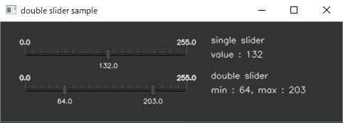

Double Slider Trackbar based on CVUI
====================================
This repository is experimental implementation of double slider tarckbar based on cvui.  
The cvui.h that included in this repository is additionally implemented based on cvui 2.7.0.  

Environment
-----------
* Visual Studio 2015/2017 / GCC 4.9 / Clang 3.4 (or later)
* OpenCV 3.4.1 (or later)
* CMake 3.14.0 (latest release is preferred)

License
-------
Copyright &copy; 2019 Tsukasa SUGIURA  
Distributed under the [MIT License](http://www.opensource.org/licenses/mit-license.php "MIT License | Open Source Initiative").

The original part of cvui is distributed under the MIT License.  
I would like to pay tribute to his great job. Thanks!  

Copyright &copy; 2016 Fernando Bevilacqua  
Distributed under the [MIT License](https://github.com/Dovyski/cvui/blob/master/LICENSE.md).

Contact
-------
* Tsukasa Sugiura  
    * <t.sugiura0204@gmail.com>  
    * <http://unanancyowen.com>  

Reference
---------
* Dovyski/cvui | GitHub  
  <https://github.com/Dovyski/cvui>
